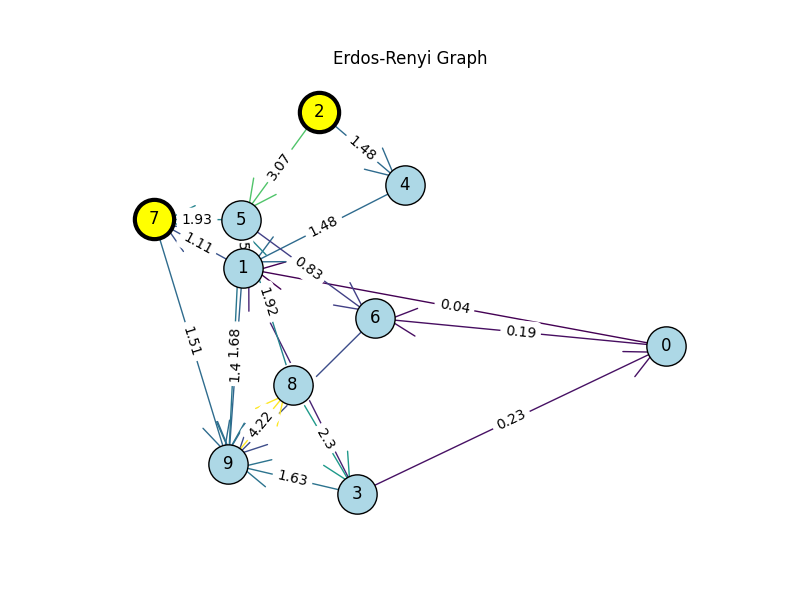
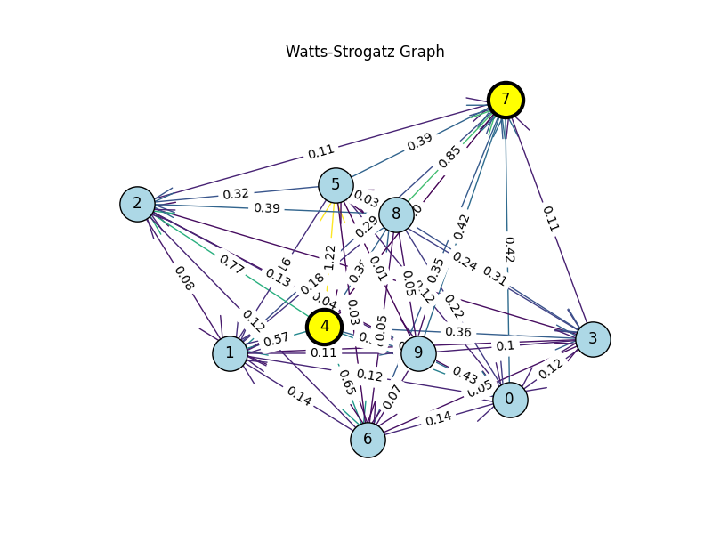

# Kirchhoff graph circuit

In this project you can generate a custom graph, connect it to voltage and assing resistance to the edges. Then the algorithm will compute current for every edge.  
Python libraries: networkx, numpy, matplotlib.

## Algorithm

1. Apply Kirchhoffs first law to every node. That gives us n-1 linear equations where n is the number of nodes in the graph.
2. Find m-n+1 base cycles using spanning tree and breadth-first-search where m is the number of edges in the graph.
3. Now that we have m equations, we solve them using matrix. (There is my implementation of gauss-jordan algorithm but I'm using numpy implementation)

## Some examples

